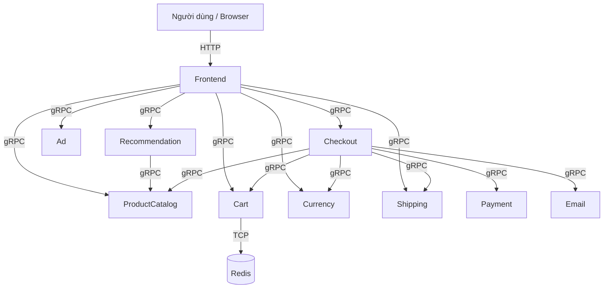
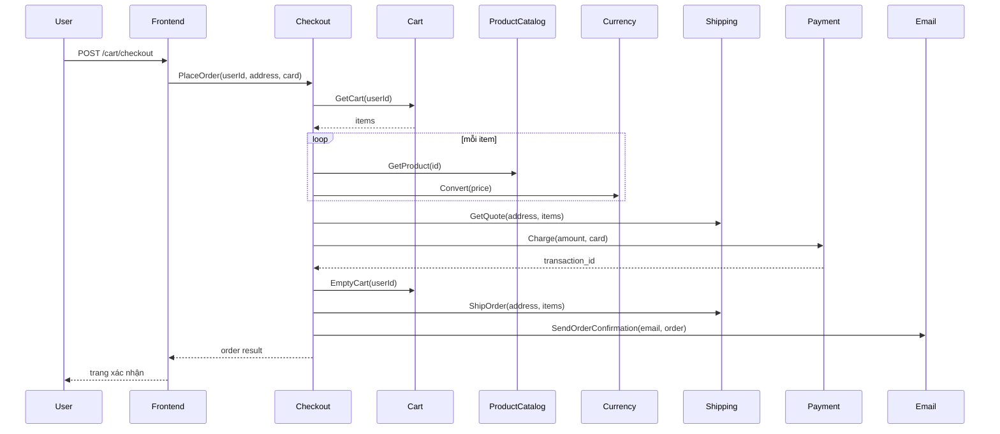
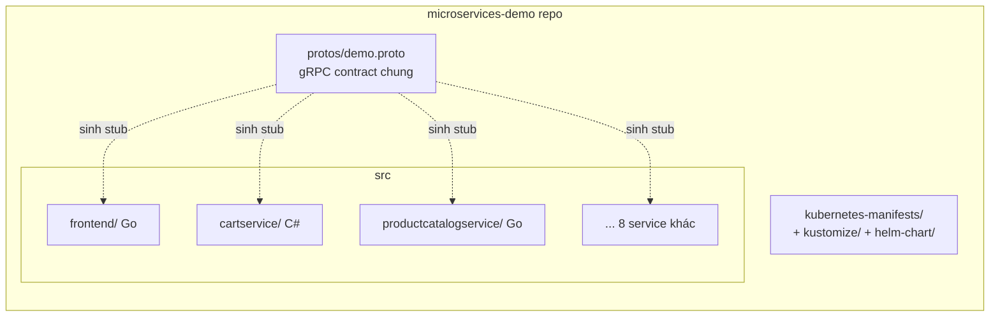
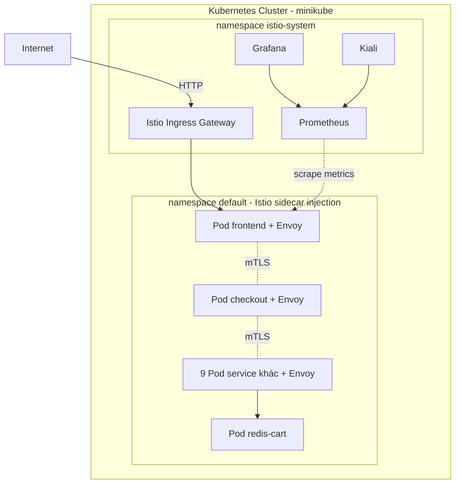
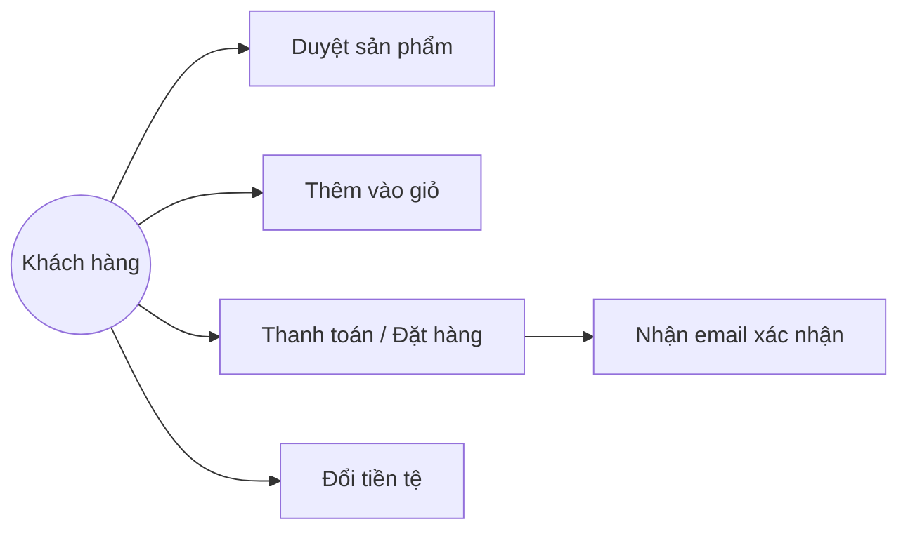
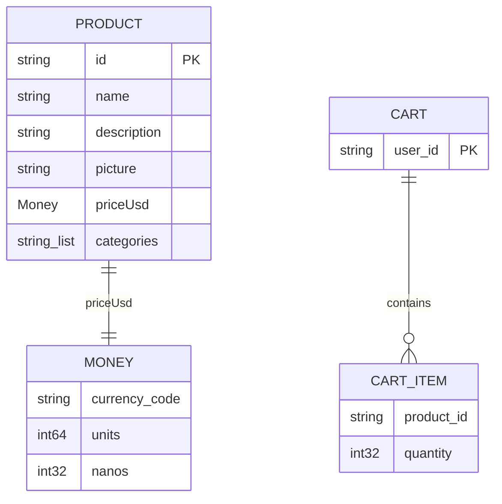
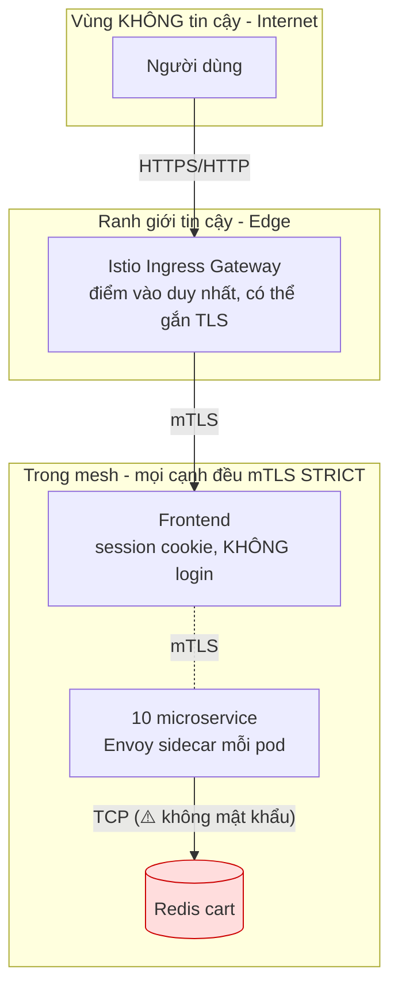
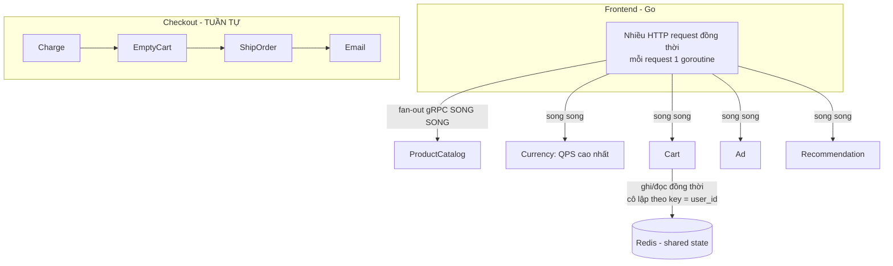

# Phần 2 — Biểu diễn kiến trúc: Online Boutique (4+1 Views + Database Schema + Security & Concurrency View)

Phương pháp: **Boxes & Arrows + 4+1 Views** (mô hình Kruchten) + **Database Schema**. Mỗi view trả lời **một mối quan tâm (concern)** của một nhóm stakeholder. Sơ đồ vẽ bằng Mermaid — mở file này trong VS Code (Preview) hoặc GitHub để render.

> ✅ **8/8 sơ đồ đã validate bằng mermaid-cli và render sẵn ra ảnh** tại `diagrams/`
> (`01-logical-view.png` … `08-concurrency-view.png`) — chiếu trực tiếp khi thi nếu không tiện preview Mermaid.
> Gồm: 4+1 Views + Database Schema + **Security View** + **Concurrency View** (2 view sau thêm vì QA được chọn là Scalability + Security).

> Nhắc quan trọng của thầy: *view ≠ UML model*. Package/Component/Deployment/Artifact là **4 UML model**. Còn 4+1 **view** là 4+1 **mối quan tâm**. Dưới đây mỗi view nói rõ nó phục vụ ai và trả lời câu hỏi gì.

Hệ thống: 11 microservice giao tiếp qua **gRPC**, frontend là web Go phục vụ HTTP.

| Service | Ngôn ngữ | Vai trò |
|---|---|---|
| frontend | Go | Web server HTTP, tổng hợp lời gọi các service qua gRPC |
| cartservice | C# | Lưu giỏ hàng vào Redis |
| productcatalogservice | Go | Danh mục sản phẩm (đọc từ products.json) |
| currencyservice | Node.js | Quy đổi tiền tệ (QPS cao nhất) |
| paymentservice | Node.js | Xử lý thanh toán (mock) |
| shippingservice | Go | Ước tính phí ship + giao hàng (mock) |
| emailservice | Python | Gửi email xác nhận (mock) |
| checkoutservice | Go | Điều phối đặt hàng: cart→payment→shipping→email |
| recommendationservice | Python | Gợi ý sản phẩm |
| adservice | Java | Quảng cáo theo ngữ cảnh |
| loadgenerator | Python/Locust | Sinh tải mô phỏng người dùng |

---

## 1. Logical View — mối quan tâm: chức năng cho end-user / phân rã domain

Các thành phần chức năng và quan hệ gọi nhau. Dành cho: nhóm phát triển, phân tích nghiệp vụ.

**Giải thích:** Frontend là *aggregator* — một request trang chủ fan-out tới nhiều service. Checkout là *orchestrator* của luồng đặt hàng: nó gom giỏ (Cart), định giá (ProductCatalog + Currency), tính ship (Shipping), trừ tiền (Payment), rồi gửi mail (Email). Đây là kiểu **orchestration** (không phải choreography/event-driven).

---

## 2. Process View — mối quan tâm: hành vi runtime, đồng thời, luồng một giao dịch

Sequence luồng **Place Order** (đồng thời, thứ tự gọi). Dành cho: kỹ sư hiệu năng, tích hợp.

**Giải thích:** Checkout gọi tuần tự và đồng bộ (blocking gRPC). Payment phải thành công trước khi EmptyCart — điểm bàn về **transaction/consistency**: không có distributed transaction, nếu Email lỗi thì đơn vẫn coi như đã đặt (email là mock, không critical). Đây là chỗ nói về **Concurrency concern**.

---

## 3. Development View — mối quan tâm: tổ chức mã nguồn, build, dependency

Cách code được module hóa. Dành cho: lập trình viên, quản lý cấu hình.

**Giải thích:** `protos/demo.proto` là **hợp đồng dịch vụ (interface contract)** duy nhất, mọi service sinh stub từ đây → cho phép polyglot (Go/C#/Python/Node/Java) mà vẫn giao tiếp được. Mỗi service một thư mục, một Dockerfile, deploy độc lập → đúng nguyên tắc microservices "independently deployable".

---

## 4. Physical / Deployment View — mối quan tâm: ánh xạ phần mềm lên hạ tầng

Container chạy ở đâu trên Kubernetes + Istio. Dành cho: DevOps, vận hành.

**Giải thích:** Mỗi pod có **Envoy sidecar** (Istio) → traffic service-to-service đi qua Envoy, tự động mTLS + thu thập metric. Ingress Gateway thay cho LoadBalancer `frontend-external`. Prometheus scrape metric từ sidecar, Grafana vẽ dashboard, Kiali vẽ topology real-time. Đây chính là phần 3 của đề.

---

## +1. Scenario View (Use Case) — mối quan tâm: gắn kết 4 view qua kịch bản người dùng

**Giải thích:** Kịch bản "mua hàng" chạy xuyên qua cả 4 view: Logical (service nào tham gia), Process (thứ tự gọi khi checkout), Development (code ở service nào), Physical (chạy ở pod nào). Đây là vai trò của view "+1": **liên kết và kiểm chứng** 4 view kia.

---

## Database Schema

Online Boutique **không dùng RDBMS trung tâm** — dữ liệu phân tán theo pattern **database-per-service**:

**Giải thích từng store (điểm quan trọng của thầy — mỗi service tự quản dữ liệu):**
- **ProductCatalog**: dữ liệu tĩnh, đọc từ `products.json` (không DB). Schema xem ở trên (id, name, description, picture, priceUsd = Money{currency_code, units, nanos}, categories).
- **Cart**: lưu ở **Redis** (key = user_id, value = danh sách CartItem{product_id, quantity}). Đây là store *có state* duy nhất.
- **Các service khác** (payment, shipping, email, currency, recommendation, ad): **stateless**, không có DB — nhận request, trả kết quả tính toán (hoặc mock).
- Kiểu `Money{units, nanos}` (không dùng float) để tránh sai số dấu phẩy động khi tính tiền — đáng nêu như một quyết định thiết kế tốt.

**Nếu thầy hỏi "sao không có ERD to?":** vì kiến trúc microservices chủ trương **decentralized data** — mỗi service sở hữu dữ liệu của mình, không chia sẻ schema/DB chung, giao tiếp qua API (gRPC). Đó là điểm khác biệt cốt lõi so với kiến trúc monolith 1 DB.

---

## Security View — mối quan tâm: bảo mật (QA Security đang được quan tâm)

> Đề nêu rõ: có thể thêm Security View *tùy Quality Attributes được quan tâm*. Vì nhóm chọn QA **Security**, đây là view bắt buộc phải có. Nó thể hiện **ranh giới tin cậy (trust boundary)**, cơ chế xác thực/mã hóa, và các điểm yếu.

**Giải thích các cơ chế & điểm yếu (khớp với `../02-security/SECURITY-AUDIT.md`):**
- **Trust boundary:** Internet → Ingress Gateway (điểm vào duy nhất). Mọi thứ sau gateway là "trong mesh".
- **AuthN/AuthZ:** app **không có đăng nhập** — chỉ định danh phiên bằng cookie session (điểm yếu #2: cookie thiếu `HttpOnly/Secure/SameSite`).
- **Mã hóa in-transit:** mặc định gRPC nội bộ là **plaintext** (điểm yếu #1). Đã khắc phục bằng **Istio `PeerAuthentication STRICT` → mTLS** toàn mesh (không sửa code).
- **Data-at-rest / store:** **Redis không đặt mật khẩu** (điểm yếu #4, ô đỏ) — cần `requirepass` + NetworkPolicy.
- **Hardening tốt:** Pod Security Context (`runAsNonRoot`, `drop ALL capabilities`, `readOnlyRootFilesystem`).
- **Tactics bảo mật thể hiện ở đây:** *authenticate/authorize* (mTLS 2 chiều), *limit exposure* (1 ingress duy nhất), *encrypt data* (mTLS), *least privilege* (security context).

---

## Concurrency View — mối quan tâm: xử lý đồng thời & chia sẻ trạng thái

> View này thể hiện hệ thống xử lý **nhiều request song song** thế nào và **tranh chấp trạng thái dùng chung** ở đâu — liên quan trực tiếp tới QA Scalability/Performance đã đo bằng k6.

**Giải thích các điểm đồng thời:**
- **Frontend:** mỗi HTTP request chạy trên **một goroutine riêng** → xử lý song song nhiều người dùng. Một request trang chủ lại **fan-out gọi song song** ~5 service gRPC (chính là lý do fault-injection delay tích lũy 35s ở `RESULTS.md`).
- **Shared state duy nhất = Redis (giỏ hàng):** truy cập đồng thời từ nhiều request, nhưng **cô lập theo `user_id`** nên không đụng độ giữa các user. Đây là điểm khiến frontend **stateless → scale-out được** (đã demo bằng HPA).
- **Checkout = tuần tự có chủ đích:** Charge → EmptyCart → ShipOrder → Email phải theo thứ tự (không song song) để đảm bảo tính đúng đắn giao dịch — đánh đổi throughput lấy consistency.
- **Mỗi service:** gRPC server dùng **thread pool / async** xử lý nhiều lời gọi đồng thời (VD Python dùng `concurrent.futures`).
- **Tactics liên quan:** *introduce concurrency* (goroutine, fan-out song song), *maintain data consistency* (cô lập theo key, checkout tuần tự).

---

## Kiến trúc phong cách gì? (câu hỏi hay bị hỏi)

- **Architectural style:** Microservices + client-server; giao tiếp **RPC (gRPC)** đồng bộ (không phải event-driven/message-bus).
- **Frontend:** API Gateway / Aggregator pattern.
- **Checkout:** Orchestration pattern.
- **Data:** Database-per-service, phần lớn stateless.
- **Cross-cutting** (bảo mật, observability, traffic): tách ra **service mesh (Istio)** thay vì nhúng vào từng service — đây là điểm để nối sang phần 3.
